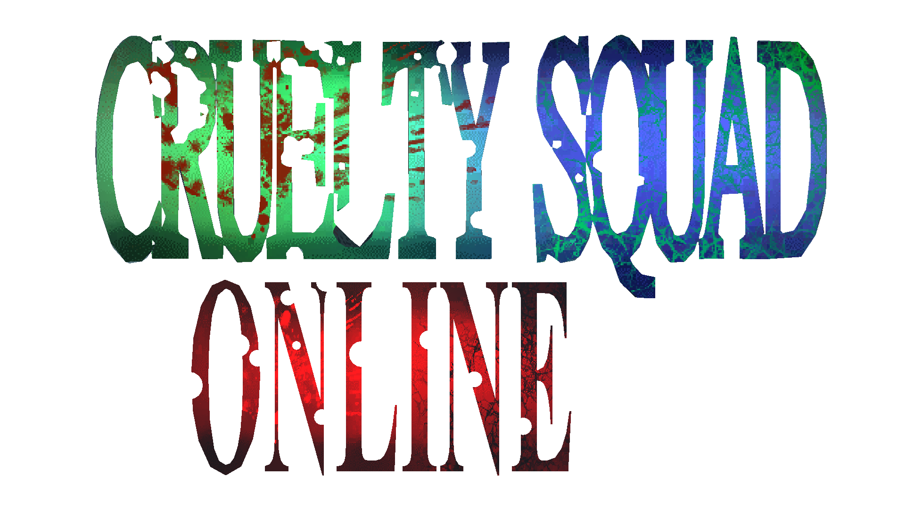

# Cruelty Squad Online

[English](README.md) | Русский

> [!WARNING]
> Данная модификация находится в открытом **Бета** тестировании
> 
> Вы можете столкнуться с багами и плохой производительностью

## Описание
Cruelty Squad Online (CruS Online) это большая модификация для игры [Cruelty Squad](https://store.steampowered.com/app/1388770/Cruelty_Squad/) которая добавляет в игру Steam и LAN мултиплеер на базе лобби

## Установка
CruS Online устанавливается таким-же образом как и другие модификации

1. Установить [CruS Modloader](https://github.com/CruS-Modding-Infrastructure/crus-modloader)
2. Скачать последнию версию CruS Online [отсюда](https://github.com/TriggeredP/crus-online/releases)
3. Распаковать архив CruS Online по пути: `%appdata%\Godot\app_userdata\Cruelty Squad\mods`
4. Запустить игру

> [!CAUTION]
> CruS Online на данный момент не совместим с другими модификациями

## Создание лобби
Данная модификация предоставляет два способа соединения игроков:

1. Через Steam
2. Через LAN

**Steam:**
Что-бы создать лобби в игре нужно:

1. Открыть меню CruS Online (Вторая иконка в главном меню)
2. Выбрать Steam режим подключения
3. Нажать на кнопкку `Create` для того что-бы создать лобби

**LAN:**
Есть два способа создания лобби через LAN подключение:

1. Переадресация портов
2. Использование VPN приложения (По типу Radmin VPN)

Лучшим способом была бы переадресация портов, поскольку это поможет повысить производительность, но если вы не можете переадресовывать порты, вы можете использовать Radmin VPN или аналогичные приложения

Так-же, у хоста должен быть хороший компьютер, иначе это может повлиять на производительность

Что-бы создать лобби в игре нужно:

1. Открыть меню CruS Online (Вторая иконка в главном меню)
2. Выбрать LAN режим подключения
2. Перейти во вкладку `Host` и указать открытый порт (Не важно если вы используете Radmin VPN)
3. Перейти во вкладку `Main` и нажать на кнопку `Host`
4. Поделится своим IP и портом с теми, с кем вы собираетесь играть

## Подключение к лобби
После того как хост создал лобби, игроки должны:

**Steam:**

1. Открыть меню CruS Online (Вторая иконка в главном меню)
2. Выбрать Steam режим подключения
3. Выбрать нужное лобби из списка (Или получить приглашение от хоста)
4. Нажать на кнопку `Join` что-бы подключится к лобби

**LAN:**

1. Открыть меню CruS Online (Вторая иконка в главном меню)
2. Выбрать LAN режим подключения
2. Ввести полученный от хоста IP и порт
3. Нажать на кнопку `Join`

## Запуск игры
После того как все подключились к лобби, игроки должны выбрать оружие и импланты

После того как все игроки готовы, хост должен выбрать уровень и нажать на кнопку `Start misson` для игры в уровни основной игры

Так-же вы можете сыграть на картах которые есть в модификации, найти вы можете их во вкладке `DM`

После того как игра начнется, новые игроки не смогут подключится к лобби

## Полезная информация

Вы можете сменить ник, цвет и скин во вкладке `Player`
Во вкладке `Host` есть кучу параметров которые можно поменять по своему вкусу

## Ссылки
Мой сайт: https://triggeredp.site

YouTube: https://www.youtube.com/@triggeredp

Boosty: https://boosty.to/triggeredp
